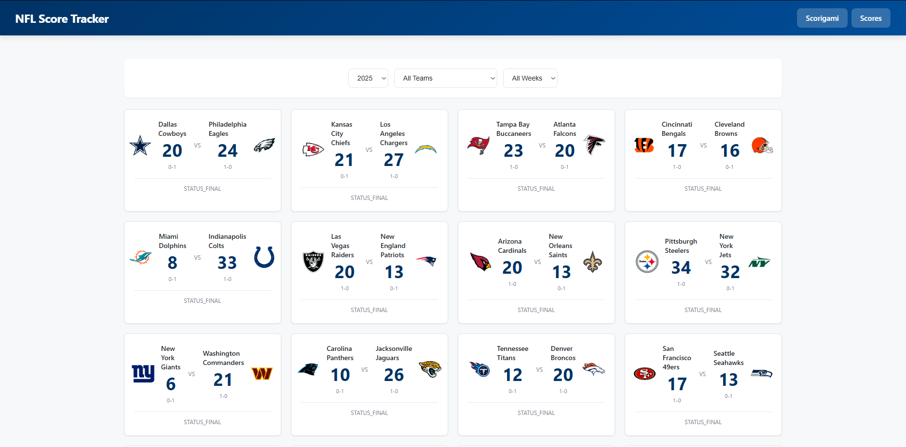
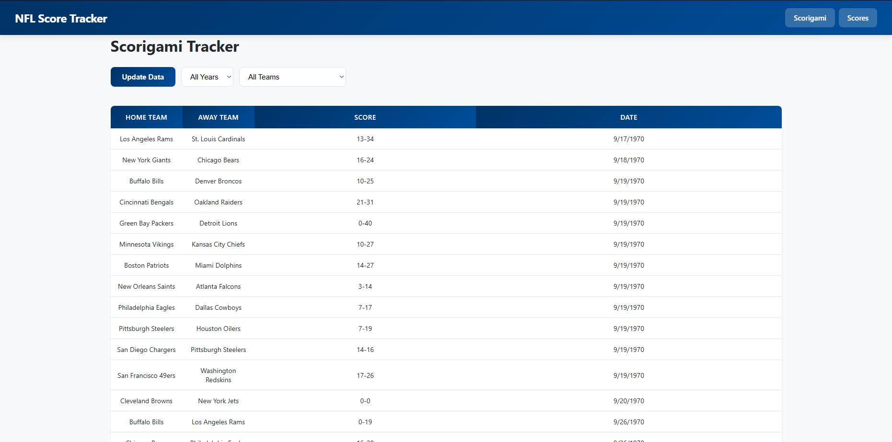
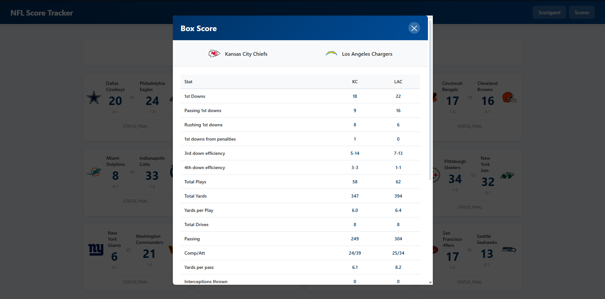

# NFL Score Tracker

A React-based web application for tracking and analyzing NFL game scores, with a focus on unique score occurrences (Scorigami).

## Features

- **Score List**: Browse all NFL games with filtering by year and team
- **Scorigami Tracker**: View unique score combinations that have only occurred once in NFL history
- **Box Score Details**: Click any game card to view detailed statistics
- **Data Caching**: Backend server caches game data to minimize API calls
- **Responsive Design**: Modern UI with gradients and hover effects

## Screenshots

### Score List


### Scorigami Tracker


### Box Score Details


## Tech Stack

- **Frontend**: React 18+, React Router, Axios
- **Backend**: Node.js, Express.js
- **API**: ESPN API for game data
- **Styling**: Custom CSS with CSS variables

## Installation

1. Clone the repository:
```bash
git clone https://github.com/CadenEbert/nflScoreTracker.git
cd nflScoreTracker
```

2. Install frontend dependencies:
```bash
cd nflscoretracker
npm install
```

3. Install backend dependencies:
```bash
cd ../server
npm install
```

## Running the Application

1. Start the backend server:
```bash
cd server
npm start
```
The server will run on `http://localhost:5000`

2. In a new terminal, start the React app:
```bash
cd nflscoretracker
npm start
```
The app will open at `http://localhost:3000`

## Usage

- **Score List**: Select a year and/or team to filter games
- **Scorigami**: Click "Update Data" to fetch the latest games, then filter by year or team to explore unique scores
- **Box Score**: Click any game card to view detailed statistics for that game


